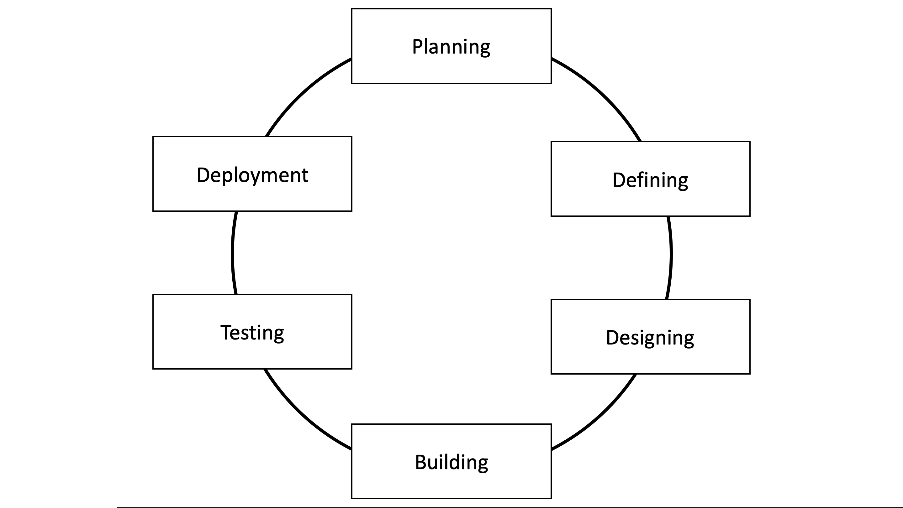

The Software Development Life Cycle
===================================

The software development life cycle (SDLC) is a process *definition* that 
specifies how the industry chooses to develop software projects. It is 
standardized in ISO/IEC 12207 and wants to define all tasks required in order
to implementing (and maintaining) a software project.

    Software Development Lifecycle (or SDLC).

Step 1 - Requirements Analysis
------------------------------

In this crucial step the requirements of a software project are defined. 
Sometimes also referred to as *Requirements Engineering* this step is done 
by the development team in conjunction with the customer, the sales & marketing
team and any other outside stakeholders. 

This step also aims at specifying the risk factors that may be present in 
this project. 

An example for a requirement would be the fact that a user wants to be able to edit a 
message in Webex Teams. 

Step 2 - Requirements Definition
--------------------------------

After analysing all requirements and risks the next step is to define them. 
The outcome of this step is a **Software Requirement Specification** (or SRS) 
that specifies all requirements and risks that can be seen in this project.

One common tool in this definition are *Use stories* (you will hear more about them in the next chapter). 
An example of such a use story, based on above requirement, would be 

*As a* Webex Teams user *I want to be able to* 
change messages that have been sent *so that* I don't have to always correct my messages with another message.

Step 3 - Design the System
--------------------------

Based on the SRS we then design the system itself. The **Design Document Specification** (or DDS)
captures how the system is designed. This can (and should) include

* A overview of all modules that are impacted by the changes 
* How data flows between these modules
* Which new modules are added to the system

In our example impacted modules might be the API(We need to provide API functionality to change a message),
the database layout (instead of overwriting the old message we might want to save a new version).

Step 4 - Develop the Code
-------------------------

Based on the DDS the developers next are able to implement(read: code) the product. The choice of programming 
language(s) used is usually dependent on the programming languages already used, the product being developed 
(developing a web application in assembler is rather non-sensical) and the teams knowledge (retraining 5 python 
programmers to develop in Java won't do a lot of good).

In big teams a **Coding Convention** is often introduced to make sure that all the code "looks" the same. Part of 
such a coding convention could be for example the way to name variables (always use `lowerCamelCase` or `slash_seperated`)
or how to indent code (tabs vs spaces).

In our example the back-end services might be implemented in python and thus the team uses this language to make 
the changes. 

Step 5 - Testing
----------------

Testing used to be a separate step after the implementation. Today most software is continuously tested during the 
implementation phase. 

In our example this would mean writing **unit tests**, **integration tests** and **user tests**. You will learn 
more about these in the chapters to follow. 

Step 6 - Deployment
-------------------

In this stage the product is rolled out into the market. This might include first rolling it out to a limited 
subset of users to check if the functionality works or just releasing the software. 

Deployment cycles have become much much shorter in the past two decades. Where it used to be acceptable to 
deploy new code once a quarter or once every half a year todays web software gets continuously updated, often 
every minute. 

After a successful deployment we jump into the next planning phase. 

Based on this cycle many flavors have been developed. Examples include 

* Waterfall Model 
* Iterative Model 
* Spiral Model 
* V-Model
* Big Bang Model
* Agile

and many many more. 

What is the right development model for me?
-------------------------------------------

Even though **agile** seems to be on vogue right now there is no generally right or wrong here. So 
lets have a look at different development models and discuss their pros and cons. 

Waterfall Model
^^^^^^^^^^^^^^^ 

.. figure:: _static/waterfall.png
    :width: 100%
    :align: center

The waterfall model was amongst the first development models used. In this model every step leads to 
the next one and, once finished, steps are not revisited until the next cycle. Due to this restriction 
waterfall models are best suited for projects with 

* well documented, understood and fixed requirements
* well established technology
* short project lifetime

Advantages of this model are 

* Simplicity
* Low management overhead due to clear deadlines, clear stages and simple milestones

Disadvantages of this model are 

* No working product until long into the cycle. This leads to a high risk of failure due to inadequately understood requirements or factors.
* No agility to react to changing requirements

Iterative Model
^^^^^^^^^^^^^^^

The iterative model aims to be more resilient to changes in the requirements. Instead of implementing all 
features in one big cycle the team starts with implementing a small subset of requirements. In each *iteration* 
a new set of requirements is implemented until a fully functional product is released. 

Special to this model is that, initially, only major requirements are needed. After each iteration the 
need for new requirements is assessed and, if need be, new requirements and design considerations are added.

The SRS and DDS are thus seen as a "living" document that can be added to instead of a set collection of requirements.

The iterative model is well suited for projects where 

* Major requirements are defined but details may be added later
* A product needs to be shipped that can then be enhanced over time (Time-to-Market Constraints)
* High-risk requirements exists that may or may not change in the future

Advantages of this model are 

* Early working prototypes can serve as frequent *deliverables*. This leads to easier incorporation of customer feedback since working versions can be tested.
* Easy milestones and progress definition
* Testing and debugging is easier on small, incremental, iterations
* Smaller cost of change due to more flexible requirements definition

Disadvantages are 

* Issues with overall system architecture may arise due to design-critical requirements not being gathered at the beginning
* Complex management leading to a unsuitability for small projects
* No clear end of project

Spiral Model 
^^^^^^^^^^^^

The spiral model is a logical combination of the waterfall and iterative model. It focuses on risk and leverages the 
incremental nature of the iterative model to enhance the product as well as mitigating the risk. 

Each **phase** of the software development process (one loop in the spiral) goes through the same four steps

1. **Objectives determination** Gathering of requirements and customer feedback to define objectives for the next phase. Often, alternative solutions are assessed in this phase. 
2. **Risk Identification and Design** A design (prototype) of the solution is created and associated risks are assessed. 
3. **Development** A working model of the software is developed. In the *baseline spiral* (the first phase of the development) a proof-of-concept is developed that is then send to the customer for feedback. In subsequent spirals a new build is send to the customer for feedback.
4. **Review** The progress is reviewed, risk assessed and the next phase is planned.

Phases can have different lengths and the exact number of phases needed to complete the project is unknown.

The spiral model is best suited for projects where 

* run-time of the project is long
* the requirements are unclear and/or complex
* the project has a high risk (either from a technical or financial perspective)
* a new product should be introduced in phases to constantly gather and incorporate customer feedback

Advantages of this model are 

* Changing requirements can be accomodated
* Due to the ability to produce a prototype in every phase risk can be addressed more easily and users can provide feedback in every phase of the development

Disadvantages of this model are 

* Complex management leading to a large overhead. This overhead is usually too large for small to medium size projects or projects with low associated risk
* Finalization of the project is unknown
* No clear timeline for milestones and/or deadlines

Big Bang Model 
^^^^^^^^^^^^^^

The Big bang model is a model that imposes no process onto the development team. Requirements, implementation and testing are 
done "on the fly" and at the discretion of the developers. 

The big bang model is best suited for projects with 

* Very small teams (one to two developers)
* Unclear requirements as well as unclear deadlines

Advantages of this model are

* No planning required
* Low overhead 
* High flexibility for the developers

Disadvantages of this model are 

* High risk and uncertainty of completion. The finishing of the project depends on the developers actually being able to deliver. 
* No planning or design may result in expensive redesigns/rewrites or messy overall architectures

Agile Model 
^^^^^^^^^^^

The agile model is a iterative and incremental development model where a product is split into small incremental builds. 
Every cycle (or iteration) involves the agile team to work on aspects like

* Planning 
* Requirements 
* Design
* Development 
* Testing (Unit, Scenario and Acceptance)

Holy to the agile approach is the aspect of having a shippable, improved product after each cycle. 

The agile manifesto defines four major beliefs

* **Individuals and Interactions over process and tools** states to focus on self-organization and communication between the parts of the team are important  
* **Working Software over comprehensive documentation** instead of showing a document what the software *will* be able to do, show a working software that can do this. Agile defines working software as the best means of communication with the customer.
* **Customer collaboration over contract negotiation** instead of negotiating a contract at the beginning collaborate with the customer to build a satisfactory product
* **Responding to change over following a plan** instead of following a plan set before respond to change by adapting

The main difference between agile and the other models presented so far is that agile aims to be a **adaptive** approach compared 
to the **predictive** nature of the other models. Where predictive models rely on the analysis and planning phase to correctly asses 
the needs of a project agile accepts that most projects change and thus focuses on allowing the development team to adapt to these changes.

Frequent testing and constant interaction with the customer minimize the risk of major obstacles in the future. 