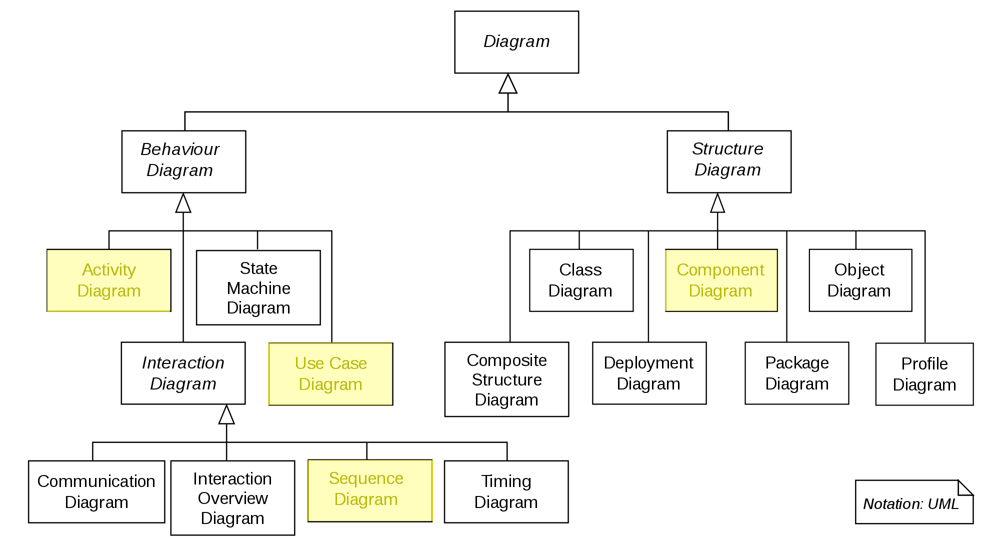

Software Architecture
=====================

In this tutorial I will use software architecture as a synonym for 
software architecture and software design. The fields are both very related.

Unified Modeling Language (UML)
-------------------------------

Unified Modeling Language (or UML) is a modeling language intended to specify the behaviour and structure of 
a software. It does this by specifying a number of diagrams that can be used to express workflows and strutures 
of a software in a visual way. 

The number of types of diagrams within UML is vast and (in typical UML fashion) can be 
represented by a UML diagram itself. 

    The UML diagram family tree.
    

There are two families of diagrams. **Structure diagrams** defining the 
structure of our solution and **Behaviour Diagrams** defining the behaviour of
our solution. 

In this tutorial we will focus on 

* Activity Diagrams 
* Use Case Diagrams
* Sequence Diagrams 
* Component Diagrams

Component Diagram 
^^^^^^^^^^^^^^^^^

Component Diagrams summarize the components of a software and how these components interact 
with each other. Component Diagrams specify the *interface* a component provides or requires.

    The different types of components in a component diagram. (1) is a simple component. (2) shows the left component defining an interface (symbolised by the circle) and another component requiring that interface (symbolised by the half-circle). (3) shows a component depending on another component and (4) is a "port". Ports are ways for components to expose functionalities (i.e. via an API).

Use Case Diagram 
^^^^^^^^^^^^^^^^

A use case diagram captures all high level use cases and their interactions within a system as well as all actors involved. 

The diagram below shows a (truncated) use case diagram for the processes in a restaurant.

Activity Diagram
^^^^^^^^^^^^^^^^

A activity diagram is a graphical representation of a workflow that support choices, iterations and concurrency. 

In its intended form activity diagrams can be used to model computational workflows (i.e. program flows) as well as 
organizational workflows. 

In a workflow diagram a 

* **ellipses** represents an action 
* **diamond** represents a decision
* **bars** represent the start or end of a concurrent activity (parallel execution)
* **black circle** represents the start of the workflow
* **encircled black circle** represents the end of the workflow
* **arrow** represents the flow of the execution

The diagram below shows the workflow for coming to the office. 

Sequence Diagram 
^^^^^^^^^^^^^^^^

A sequence diagram shows the interaction between objects (or components) in the fashion of a timeline. They usually represent one use case. 
They are sometimes also referred to as event diagrams or event scenarios. 

The main building blocks of these diagrams are:

* **Lifeline** the vertical lifeline represents the lifespan of this object/component
* **Blocks** the object(s) that interact with each other 
* **Messages** written on horizontal arrows to display a interaction between two components. Blocking (or synchronous) messages are represented by a full arrow had, non-blocking (or asynchronous) messages are represented by open arrow heads. Responses are dashed arrows. 
* **Activation boxes** are rectangles placed on top of the lifeline that show a computation being performed

The diagram below shows an example sequence diagram for a HTTP request to a web server with a attached database.

Software Architecture Lab
-------------------------

In this lab you will, based on use stories and a case study, create a software architecture. 

Download the lab guide :download:`here <_static/labs/lab-architecture.pdf>`.