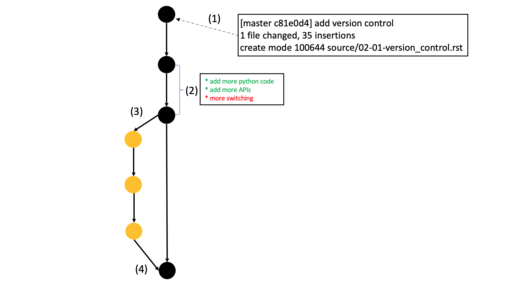

Version Control
===============

Why do we need version control? Isn't a file server where everyone just uploads new source 
code to enough? What about

* Synchronization across the team? Especially when working on the same file?
* Undoing short-term or long-term changes? You might be able to Crtl-z your way out of the last 10 edits but what about going back to that code you wrote about two months ago?
* Who changed *what*?
* All changes that are uploaded to the server are final. What if you want to send someone some early beta code?

The industry answer to this is **version control**. A version control system keeps track of the different versions of a 
file (*duh*). In doing so it can provide tremendous value to you as a developer by keeping your projects synchronized, 
giving you the ability to work on a feature, switch back to another version of the code and work on another feature, and 
transparently share these changes with your peers. You can also easily roll back to a previous version. 

**git** has become the *de-fact* standard for version control systems. Initially developed for the linux kernel it has 
wide acceptance in the open-source community and with corporations.

So popular in fact that GitHub has build a $7.5bn business out of hosting git repositories.

A primer on git
---------------

Before diving into git lets define some terms we will use 

* **Repository** A repository stores a project within the context of git. It is a folder that contains all the files as well as all the meta information used by git. This information is saved in a folder called `.git`.
* **Commit** A commit is the fundamental "unit of change" for git. A commit contains all information on how the files that have been *added* to the commit have been changed compared to the previous version. Starting from the initial commit (and following this chain of changes) we can thus get the current version of the file. Each commit has a *hash value* attached to it that uniquely identifies the commit.
* **Branch** A branch is a *set of commits*. Every project will have at least one *master* branch but the ease of branching in git makes it possible to have a lot of branches. It is very typical to have a master branch - a *develop* branch for the current (somewhat) stable development version and branches for each feature that is being developed.
* **Diff** A diff lists all the changes that have been applied to a file. It can be used to show the changes since a file has last been comited or show changes that orcured between commits.
* **Merge** A merge is the process of combining two branches into each other. The big innovation of git was to make merging branches so simple that it became feasible to have a ton of them.

A visual representation of all these components can be found in below diagram.

    \(1\) is a commit to the initial branch (usually called *master*). (2) is a diff between two commits. In (3) we create a new branch and in (4) we merge that branch (after adding a few commits) back into the master branch.

The last piece we need to add is the keyword *distributed*. Git is marketed as a *distributed version control system*. This means that, instead of having one central repository, every user has its own version of the repository on the computer. Synchronization between these is done via a *push*. While not necessarily the case many developers have come to accept the remote repository, i.e. the one on GitHub, (often referred to as *origin*) as the source of truth.

Git command-line cheat sheet
----------------------------

Following are a few commands that will become useful when dealing with git.

* Add a file to git 

.. code-block:: bash

    $ git add <path to file>

* Commit all changes you have marked with `git add`

.. code-block:: bash

    $ git commit -m "<insert commit message>"

* Show the diff of a file since the last commit 

.. code-block:: bash

    $ git diff <path_to_file>

* Create a new branch (based on the branch you are currently on)

.. code-block:: bash

    $ git checkout -b <name of new branch>

* Switch to a existing branch 

.. code-block:: bash

    $ git checkout <name of existing branch>

* Merge two branches 

.. code-block:: bash

    $ git checkout <name of branch you want to merge into>
    $ git merge <name of branch you want to merge>

* Push your changes 

.. code-block:: bash

    $ git push <remote host (usually origin)> <remote branch>

Version Control Lab
-------------------

In this lab you will clone a repository, create a branch, apply changes, commit them and merge the branches.

Download the lab guide :download:`here <_static/labs/lab-architecture.pdf>`.