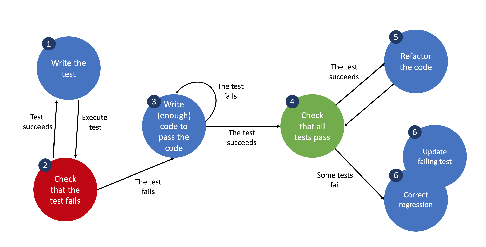

Test-Driven Development (TDD)
=============================

When doing test-driven development a developer uses test to guide the development. The test(s) basically become a code version of the requirements. The following sequence when developing software units in TDD should thus be followed.

The steps are as follows 

* **Write the test** Write the test for the functionality you want to implement
* **Check that the test fails** Check that the test you are writing actually fails (as it should, since you have not implemented the functionality yet). 
* **Write enough code to pass the code** The idea here is to get a minimal implementation that makes all test cases pass. The motivation here is to get a initial working version of the feature.
* **Check that all tests pass** Check that the entire test suite passes. This means that your new feature or change does not break any other component.
* **Refactor the code** Since the initial implementation could be messy, refactor the code to fullfil your quality requirements
* **Correct regression**  and **Update failing tests** Correct your code so that old tests (*regression* means that old tests are breaking) pass and/or update the failing tests.